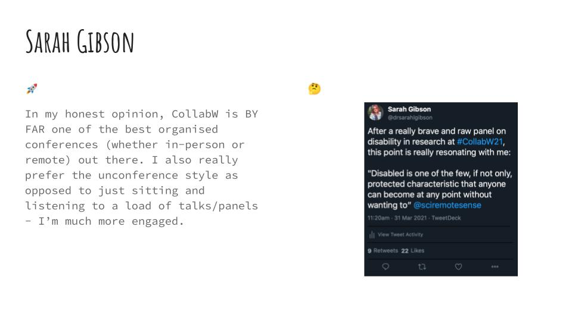
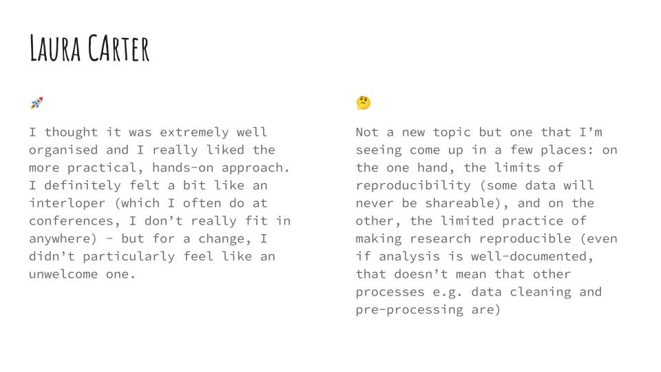
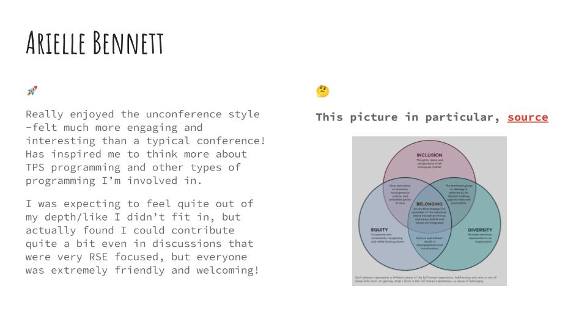
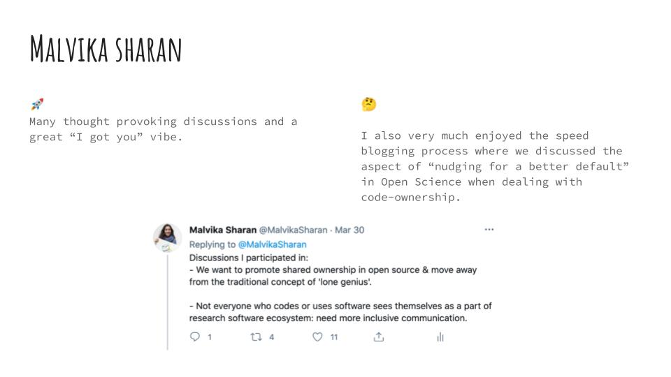
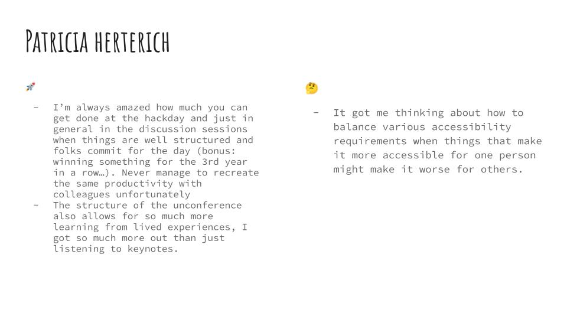
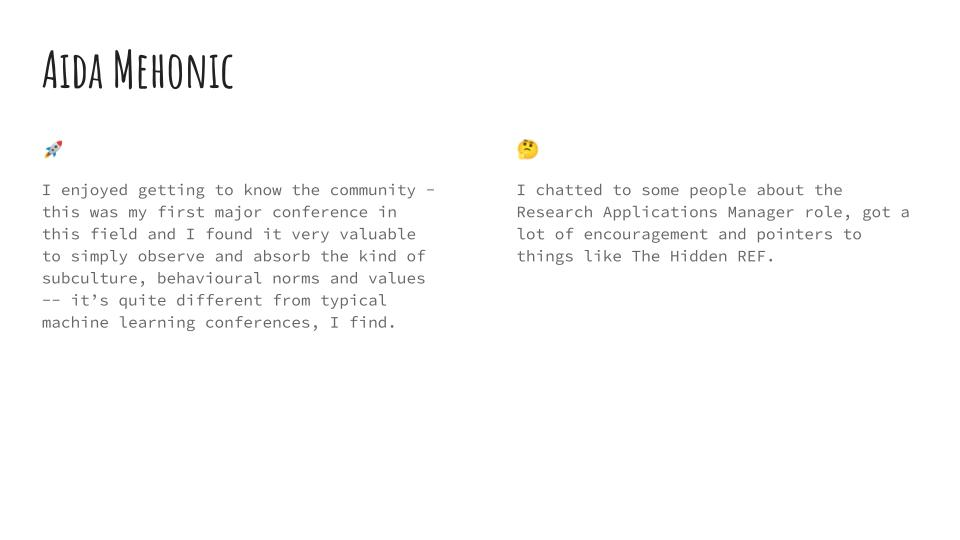

At the end of March 2021, meny member's of the Whitaker Lab attended the Collaborations Workshop hosted by the Software Sustainability Institute and, at the following lab meeting, those who attended shared their experiences with the rest of the lab.
This is a blog post covering the event and the lab member's reflections from it.

## What is the SSI?

The [Software Sustainability Institute](https://software.ac.uk/about) (SSI for short) is a network of UK universities, Research Software Engineering groups and policy makers dedicated in improving the quality, sustainability and recognition of research software.
They help the members in their network learn software skills and best practices, and advocate for culture change in their organisations and institutions.

Many members of the lab (current and past) are also [SSI Fellows](https://software.ac.uk/programmes-and-events/fellowship-programme).
[Can you spot them?](https://software.ac.uk/about/fellows)

## What is Collaborations Workshop?

The [Collaborations Workshop](https://software.ac.uk/programmes-and-events/collaborations-workshops) (often shorted to CollabW) is an annual, 3-day event focussed around bringing together researchers, software developers, data librarians, managers, funders and anyone else who cares about research software to explore important ideas around software and research and foster interdisciplinary collaborations.

CollabW features a few keynotes but it is largely run as an [unconference event](https://unconference.net/unconferencing-how-to-prepare-to-attend-an-unconference/) with lightning talks, discussion sessions, mini workshops, and speed blogging events all relating to one or a few central themes.
This feels radically different to traditional conference events as you are elevated from audience member to participant, giving you the opportunity to create something during the event and have discussions with a wide variety of other attendees.

The final day features a [hack day](https://software.ac.uk/cw21/hack-day) where small teams can work on community-generated projects addressing a need they see in the research software community.
Importantly, these do not have to be software projects to be eligible.
Documentation and event planning projects, among others, have also featured at previous hack days.
But most important of all, there are prizes up for grabs for the top 3 projects! :wink:

## CollabW21

The central themes of [CollabW21](https://software.ac.uk/cw21), hosted online from 30th March to 1st April 2021, were FAIR Research Software, Diversity and Inclusion, and Software Sustainability.

Some of the highlights included an inspiring [keynote on Diversity and Inclusion](https://youtu.be/8viA4y1pz_8?t=1943) from [Dr Chonnettia Jones](https://www.msfhr.org/chonnettia-jones) and an unbelievably brave panel discussion on [Disability and Accessibility in Research Software](https://www.youtube.com/watch?v=65a8c06VHOY).

## The Lab's Reflections

At the lab meeting after the event, each member that attended was asked to produce a slide reflecting on their experience at CollabW21.
They were asked to highlight something they really enjoyed, was unexpected, or completely different to past conference experiences (signified by the :rocket: emoji); and a topic that resonated with them, got them thinking, that they’d like to share/discuss with the lab (signified by the :thinking: emoji).
You can see their slides below.

_Source link: https://www.krysburnette.com/blog/2019/1/22/belonging-a-conversation-about-equity-diversity-amp-inclusion_

As you can see, themes around disability, diversity, inclusion and accessibility resonated particularly strongly within the group.
But the unconference style felt very refreshing, if not a little exhausting!

Additionally on the third day of CollabW, Sarah and Patricia's hackday projects on [Research Dugnads](https://research-dugnads.github.io/dugnads-hq/) and [Coding Confessions](https://coding-confessions.github.io/) won 3rd and 2nd place, respectively!
Well done Sarah and Patricia!
